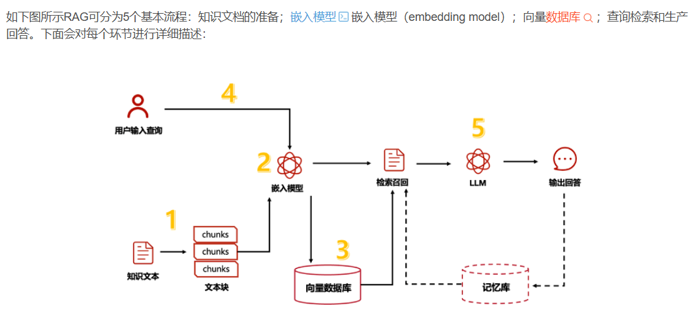

# 面试知识

## AI agent

### 提示词Prompt工程你怎么理解？

Prompt 工程本质上是通过设计输入结构，让模型更稳定地完成任务，而不是单纯把提示词写长。它关注的是角色设定、任务目标、输出格式、约束条件、示例设计、上下文组织和拒答边界。

在 Agent 系统里，Prompt 工程往往和模型、工具、RAG、记忆一起配合。比如知识问答要强调“仅基于证据回答”，工具调用要强调“只输出 JSON 参数”，多轮改写要强调“不要改变用户原意”。Prompt 不是万能的，但它是连接模型能力和业务需求最直接的一层。

### 提示词Prompt工程的作用？

提示词工程的核心价值，在于解决大模型应用中**用户意图与模型输出的对齐问题**。它能通过结构化指令精准框定内容框架与输出格式，让模型生成符合要求的数据报告；也能借助 Few-shot 示例注入专业术语，在医疗咨询等场景中提升回答准确性。同时，它还能划定模型的安全边界，避免生成有害内容。从工程视角看，优质的提示词设计可以大幅降低对模型微调的依赖，快速适配多样化业务需求，是提升产品体验与开发效率的关键手段。

### RAG的流程



#### 1. 知识文本预处理（离线阶段）

将外部知识文档（如论文、手册、业务资料）切分成更小的**文本块（chunks）**。

- 目的：避免单篇文档过长，方便后续向量编码和精准检索。
- 操作：按语义 / 固定长度拆分，同时可做清洗、去重等预处理。

#### 2. 文本向量化（离线阶段）

使用**嵌入模型（Embedding Model）\**将所有文本块转换为\**向量（Embedding）**。

- 原理：把文本语义映射为高维空间中的数值向量，相似内容的向量在空间中距离更近。
- 输出：得到与每个文本块一一对应的向量表示。

#### 3. 向量存储（离线阶段）

将生成的文本块向量存入**向量数据库（Vector Database）**。

- 作用：建立高效的索引结构，支持后续快速的相似性检索。
- 特点：专门优化了向量相似度计算和大规模数据下的检索速度。

#### 4. 用户查询处理（在线阶段）

用户输入问题后，系统会：

1. 用**同一嵌入模型**将用户查询转换为查询向量。
2. 保证查询与知识库文本的向量空间一致，才能准确匹配。

#### 5. 检索增强生成（在线阶段）

这是 RAG 的核心环节，分为两步：

1. 检索召回（核心：相似度匹配）
   - 在向量数据库中，通过**相似度计算**（如余弦相似度、点积、欧氏距离等），将查询向量与库中所有文本块向量进行比对。
   - 找出与查询语义最相似的若干文本块，作为**参考知识**，这一步的相似度匹配直接决定了后续知识引用的准确性
2. **LLM 生成回答**：将用户查询 + 检索到的参考知识，一同输入大语言模型（LLM），模型基于这些外部知识生成准确、可靠的回答。

## 后训练

### 1. **预训练 (Pre-training)**

- 属于**无监督 / 自监督学习**，核心目标是让模型学习通用语言规律。
- 典型任务：预测下一个词（Next Token Prediction），通过海量文本数据构建基础语言能力。

### 2. **监督微调 (Supervised Fine-Tuning, SFT)**

- 在预训练模型基础上，使用**带标签的监督数据**（输入 - 输出对，如问答、分类样本）进行训练。
- 目标：让模型适应特定领域任务，学会遵循指令、生成符合人类预期的输出。
- 常用实现方式：**参数高效微调（PEFT）**（如 LoRA/QLoRA），在不更新全部参数的情况下节省算力与内存，避免知识遗忘。

#### 大模型微调流程总结

大模型微调是在预训练模型基础上，针对特定任务 / 领域数据进一步训练，**垂直领域比较适合**，使模型适配新任务的过程，核心流程可总结为：

1. **任务与目标确定**：明确具体任务（如文本分类、问答）与预期效果。
2. **数据准备**：收集、标注任务相关数据，并划分为训练集、验证集、测试集。
3. **数据预处理**：将数据转换为模型可接受格式，完成分词、添加特殊标记等操作。
4. **模型选择**：根据任务特性选择合适的预训练模型（如 BERT、GPT）。
5. **结构调整**：按需添加任务特定层（如分类任务的全连接层）。
6. **超参数设置**：配置学习率、批次大小、训练轮数、优化器等训练参数。
7. **模型训练**：在训练集上微调，同时监控验证集指标以防止过拟合。
8. **评估验证**：使用测试集评估性能，分析结果并迭代调整超参数或数据。
9. **部署应用**：将微调后的模型部署上线，持续监控并迭代优化。


#### 全参数微调（Full Fine-tuning）

- **核心思想**：对预训练模型的**所有参数**进行更新，让模型全面适配下游任务。
- **优点**：适配能力强，通常能取得较好的任务效果。
- **缺点**：计算资源消耗极大（需要大量显存、算力），训练成本高；容易在小数据集上发生过拟合，且会破坏模型原有的通用能力。
- **适用场景**：数据量充足、算力充裕，且对任务效果要求极高的场景。

#### 参数高效微调方法（PEFT, Parameter-Efficient Fine-Tuning）

这类方法只更新模型的**少量参数**，在保证效果的同时大幅降低训练成本，是目前工业界更常用的方案。

##### 1.LoRA（Low-Rank Adaptation）

- **核心思想**：在 Transformer 的注意力层（Attention）中插入低秩矩阵，训练时只更新这些低秩参数，冻结原模型参数。
- **优点**：显存占用极低、训练速度快，不同任务的 LoRA 权重可以插拔切换，不会破坏原模型。
- **缺点**：对部分复杂任务的效果略逊于全参数微调；需要选择合适的秩（rank）超参数。
- **适用场景**：资源有限、需要快速适配多任务的场景（如个性化对话、垂直领域问答）。

##### 2.Prefix-tuning

- **核心思想**：为 Transformer 层的输入添加可学习的 “前缀向量”，冻结原模型参数，只训练这些前缀序列。
- **优点**：参数更新量极少，能保留原模型的通用能力，适合生成类任务。
- **缺点**：训练稳定性稍差，前缀长度需要仔细调优，在部分任务上效果不如 LoRA。
- **适用场景**：文本生成、摘要、翻译等生成式任务。

#### 总结：常见的微调方法

1. **全量微调 (Full Fine-tuning)**
2. **参数高效微调 (PEFT, Parameter-Efficient Fine-Tuning)**，核心思想是：冻结主模型，只训练极少数参数。
3. **LoRA (Low-Rank Adaptation)** - 最常用，衍生：**QLoRA**。通过 4-bit 量化技术大幅降低显存需求，让你在单张消费级显卡（如 RTX 3090）上微调 70B 模型。
4. **AdaLoRA**：根据训练过程中的 “贡献度”，动态调整每个矩阵的 r。重要的层 r 可能变大，不重要的层 r 甚至可能被缩减到 0。
5. **Prompt Tuning / P-Tuning**，软提示微调，在输入文本的 Embedding 之前，拼接一段可学习的向量（称为 **Soft Prompt**）。

被问到 “怎么选微调方法” 时，通常回答：显存够、数据量极大选全量；显存受限、需要快速迭代选 LoRA；需要单卡跑大模型选 QLoRA。

#### 微调评估指标

技术指标

- **训练损失**：观察模型在训练集上的损失是否收敛，若持续下降且稳定，说明模型学习到了训练数据。
- **验证损失**：在独立验证集上检查损失，若验证损失与训练损失差距过大（如验证损失上升），可能出现过拟合。
- **分类任务**：准确率（Accuracy）、精确率（Precision）、召回率（Recall）、F1-Score、AUC-ROC 曲线等。
- **生成任务**：BLEU、ROUGE、METEOR（文本生成指标）；生成结果的流畅性、逻辑性等（人工评估）。
- **回归任务**：均方误差（MSE）、平均绝对误差（MAE）、决定系数（R²）。
- **困惑度（Perplexity）**：用于评估模型对测试数据的预测能力，数值越低代表模型对任务的适应性越好。

---

对比实验

- 与未微调的基线模型（如原版大语言模型）在同一测试集上对比，评估性能提升幅度。
- 与其他微调方法（如 LoRA、全参数微调）或不同超参数组合的结果进行对比，筛选最优方案。

---

过拟合 / 欠拟合分析

- 检查训练集与验证集的指标差异：若训练损失持续下降但验证损失上升，通常意味着模型出现了过拟合。
- 通过交叉验证（Cross-Validation）或学习曲线（Learning Curve）分析，判断模型的泛化能力，识别欠拟合或过拟合问题。

### 3. **强化学习 (RL, Reinforcement Learning)**

- 在 SFT 之后，通过 ** 人类反馈强化学习（RLHF）** 进一步对齐人类偏好。
- 核心流程：

  1. 用人类标注对模型输出打分，训练奖励模型（Reward Model）。
  2. 基于奖励模型，用强化学习算法（如 PPO）优化模型，让输出更符合人类偏好（如更有用、更安全、更有帮助）。
- 目标：让模型从 “会做任务” 升级为 “做得更好、更贴合人类需求”。

---

## Transformer 推理详解：”The capital of China is __”

以句子 **”The capital of China is”** 为例，解释 Transformer（以 GPT 系 Decoder-Only 为例）如何预测最后一个词。

### 整体流程概览

```
输入文本: “The capital of China is”
         ↓
Tokenize → [The, capital, of, China, is] → token ids
         ↓
Embedding + Positional Encoding
         ↓
┌─ Decoder Layer × N ─────────────────────┐
│  1. Masked Self-Attention (因果注意力) │
│         ↓                               │
│  2. Add & LayerNorm                   │
│         ↓                               │
│  3. Feed-Forward Network              │
│         ↓                               │
│  4. Add & LayerNorm                   │
└────────────────────────────────────────┘
         ↓
Linear + Softmax → 词汇表概率分布
         ↓
采样/贪婪选择 → “Beijing”
```

### 第一步：Tokenize（分词）

```
输入: “The capital of China is”

分词器（GPT系列用 BPE）：
“The” → 终止符大写 → token_id = 464
“capital” → token_id = 1917
“of” → token_id = 407
“China” → token_id = 2711
“is” → token_id = 318

输入序列: [464, 1917, 407, 2711, 318]
序列长度: 5
```

### 第二步：Embedding + Positional Encoding

```
每个 token_id → 768维向量（以 BERT-base 为例）
                （GPT-4 等大模型可达 12288 维）

Token Embedding:
[464] → E1 (768维)
[1917] → E2 (768维)
[407] → E3 (768维)
[2711] → E4 (768维)
[318] → E5 (768维)

位置编码（RoPE 或 Sinusoidal）:
位置1 → P1
位置2 → P2
位置3 → P3
位置4 → P4
位置5 → P5

最终输入 = Token Embedding + Positional Encoding:
X1 = E1 + P1
X2 = E2 + P2
X3 = E3 + P3
X4 = E4 + P4
X5 = E5 + P5

X_input = [X1, X2, X3, X4, X5]，形状 (5, 768)
```

### 第三步：Masked Self-Attention（带掩码的自注意力）

**核心：每个 token 只能看到自己和前面的 token，不能”偷看”未来**

```
Masked Self-Attention 计算流程：

1. Q, K, V 投影
   Q = X · W_q  (768 → 64, 多头则每头64, 12头)
   K = X · W_k
   V = X · W_v

2. 构建注意力分数（未掩码前）
   ┌─────────────────────────────────┐
   │ scores = Q · K^T / √d_k         │
   │                                 │
   │          T1   T2   T3   T4   T5 │
   │ T1 [?,    ?,    ?,    ?,    ? ]│
   │ T2 [?,    ?,    ?,    ?,    ? ]│
   │ T3 [?,    ?,    ?,    ?,    ? ]│
   │ T4 [?,    ?,    ?,    ?,    ? ]│
   │ T5 [?,    ?,    ?,    ?,    ? ]│
   └─────────────────────────────────┘
   T1 表示来自 T1 token 的 Query

3. 应用因果掩码（Causal Mask）
   对角线及左下保留，右上设为 -∞

   ┌─────────────────────────────────┐
   │          T1   T2   T3   T4   T5 │
   │ T1 [✓,   -∞,  -∞,  -∞,  -∞]│
   │ T2 [✓,   ✓,   -∞,  -∞,  -∞]│
   │ T3 [✓,   ✓,   ✓,   -∞,  -∞]│
   │ T4 [✓,   ✓,   ✓,   ✓,   -∞]│
   │ T5 [✓,   ✓,   ✓,   ✓,    ✓]│
   └─────────────────────────────────┘
   ✓ = 保留真实注意力分数
   -∞ = softmax 后变为 0（不关注）

4. Softmax 归一化
   attention_weights = softmax(scores_with_mask)
   每行和为 1，表示当前 token 对之前所有 token 的注意力分布

5. 加权求和
   output = attention_weights · V

   以 T5（预测 “is” 的下一个词）为例：
   output_5 = w51·V1 + w52·V2 + w53·V3 + w54·V4 + w55·V5
            = 关注 “The”, “capital”, “of”, “China”, “is” 的综合表示
```

### 第四步：多层堆叠（Transformer Block）

```
整个过程重复 N 层（GPT-3 有 96 层）：

Layer 1:
  Input: [X1, X2, X3, X4, X5]
    ↓ Masked Self-Attention
  Output: [H1_1, H1_2, H1_3, H1_4, H1_5]
    ↓ Add & LayerNorm
    ↓ Feed-Forward
    ↓ Add & LayerNorm
  Output: [H1'_1, H1'_2, H1'_3, H1'_4, H1'_5]

Layer 2:
  Input: [H1'_1, H1'_2, H1'_3, H1'_4, H1'_5]
    ↓ (同上)
  Output: [H2'_1, H2'_2, H2'_3, H2'_4, H2'_5]

... (重复 96 层)

Layer N:
  Output: [HN_1, HN_2, HN_3, HN_4, HN_5]
```

**为什么需要多层？**
- 浅层：捕获词语之间的局部相关性（相邻词）
- 中层：捕获短语、实体关系（”China” 是国家）
- 深层：捕获语义知识（”China 的首都是...”）

### 第五步：预测下一个词

```
取最后一层最后一个 token 的输出：HN_5

HN_5 形状: (768,) 向量
    ↓
  Linear 层: V_out = HN_5 · W_out
  W_out 形状: (768, vocab_size)，vocab_size ≈ 50000+

  V_out 形状: (50000,) — 每个词对应的”得分”
    ↓
  Softmax: probabilities = softmax(V_out)
    ↓
  概率分布 P(vocab | context)

  ┌─────────────────────────────────────────────┐
  │ “Beijing”     → 0.72                       │
  │ “Shanghai”    → 0.08                       │
  │ “Hong Kong”   → 0.05                       │
  │ “Nanjing”     → 0.03                       │
  │ ...                                       │
  │ “the”         → 0.001                       │
  │ ...                                       │
  └─────────────────────────────────────────────┘

  采样策略:
  - 贪婪解码: argmax(“Beijing”)，确定但容易重复
  - 温度采样: T>1 更随机，T<1 更确定
  - Top-K: 只从最高 K 个候选中采样
  - Top-P (Nucleus): 从累计概率达 P 的最小集合中采样
```

### 逐步追踪：为什么模型知道答案是 “Beijing”？

```
注意力机制的可解释性分析：

Token “China” (T4) 的注意力指向：

在高层（如 Layer 80）的注意力矩阵中：
- “China” 的 Query 会高度关注：
  • “capital” — 捕获”国家-首都”关系
  • “of” — 捕获所有格语法结构

这些信息汇聚到 HN_5 向量中，
包含了对”中国”和”首都”关系的深度理解。

Layer 90+ 的 Feed-Forward Network（FFN）：
- FFN 是知识存储的主要场所
- 类似 key-value 记忆
- FFN(knowledge about “China capitals”) → 激活 “Beijing”

所以当模型看到：
“The capital of China is [?]”

它经过：
1. 编码 “The capital of China is” 的语义
2. 激活 FFN 中存储的 factual knowledge
3. 汇聚到最后一个位置的表示
4. 映射到 “Beijing” 的高概率
```

### 自回归生成（Auto-Regressive）与上下文复用

```
注意：上面的计算只预测了一个词 “Beijing”

如果要继续生成 “The capital of China is Beijing _____”

已计算的内容不需要重新计算（KV Cache）：
┌─────────────────────────────────────────────────┐
│  KV Cache:                                     │
│  第一次 forward:                               │
│    input: [The, capital, of, China, is]         │
│    计算并缓存: K1-V1, K2-V2, ..., K5-V5        │
│    输出: “Beijing”                             │
│                                                 │
│  第二次 forward:                               │
│    input: [The, capital, of, China, is, Beijing]│
│    复用: K1-V1, ..., K5-V5 (来自 Cache)        │
│    只计算: K6-V6 (for “Beijing”)               │
│    输出: 下一个词                                │
│                                                 │
│  优势: 生成 N 个词只用 O(N²) 而非 O(N³)        │
│  本质: 空间换时间                              │
└─────────────────────────────────────────────────┘
```

### 完整数学形式化

```
设输入序列长度为 n，词表大小为 V，隐藏维度为 d，层数为 L

Forward Pass:

X⁽⁰⁾ = Embedding(input_ids) + PosEncoding  // (n, d)

for l in 1..L:
    # Multi-Head Masked Self-Attention
    Q = X⁽ˡ⁻¹⁾ W_q^lh                           // (n, d_h)
    K = X⁽ˡ⁻¹⁾ W_k^lh                           // (n, d_h)
    V = X⁽ˡ⁻¹⁾ W_v^lh                           // (n, d_h)
    
    scores = Q @ K.transpose(-2, -1) / √d_h     // (n, n)
    scores = scores + causal_mask                // (n, n)
    attn = softmax(scores, dim=-1)               // (n, n)
    attn_out = attn @ V                          // (n, d_h)
    
    X⁽ˡ⁾_attn = LayerNorm(attn_out + X⁽ˡ⁻¹⁾)
    
    # Feed-Forward
    ff_out = W_2 · gelu(W_1 · X⁽ˡ⁾_attn)       // (n, d)
    
    X⁽ˡ⁾ = LayerNorm(ff_out + X⁽ˡ⁾_attn)       // (n, d)

# Output Layer
logits = X⁽ᴸ⁾[-1] @ W_out                        // (V,) — 只取最后一个token
probs = softmax(logits)                          // (V,)
prediction = argmax(probs)                       // scalar
```

### 面试高频追问

| 问题 | 回答要点 |
|------|---------|
| 为什么是 Masked Self-Attention？ | Decoder 是自回归的，预测第 n 个词时不能看到第 n+1 个及之后的词，否则训练时泄露标签 |
| 为什么用 Softmax？ | 将任意实数分数转换为概率分布，归一化后可采样，概率最高的词被选中 |
| LayerNorm vs BatchNorm？ | NLP 中序列长度可变，BatchNorm 不适用；LayerNorm 独立归一化每个样本的特征维度 |
| FFN 的作用是什么？ | 两层线性变换 + 非线性激活，是存储factual knowledge的主要场所 |
| 多头注意力的意义？ | 每个头可关注不同类型的关系（语法、语义、位置等），并行捕获多种模式 |
